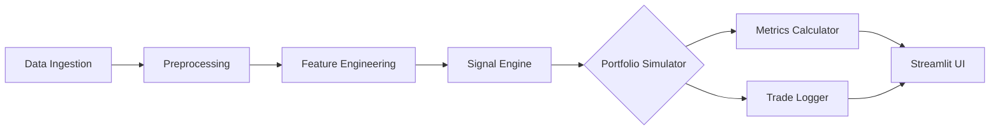

# Hedge Fund Risk Modeling & Semi-Automated Trading System

## Team Information
- **Team Name**: Vortex
- **Year**: 3rd Year(Graduating 2027)
- **All-Female Team**: No

## Architecture Overview

### 1. Approach
* **Explainable Pipeline**: We built a highly modular, 6-layer pipeline prioritizing transparency over black-box AI. Trades are driven by rule-based momentum and volatility signals, enforcing strict risk limits (25% max position cap, volatility-adjusted sizing).

### 2. Data Flow & Code Flow
* **Linear Execution**: Raw CSVs (`loader.py`) -> Outlier clipping & NaN imputation (`preprocessor.py`) -> Rolling momentum & macro alignment (`engineer.py`) -> BUY/HOLD/SELL signals (`signals.py`) -> Portfolio state execution with slippage/costs (`simulator.py`) -> Risk evaluation (`calculator.py`).

### 3. Tech Stack
* **Python, Pandas & NumPy**: Enables high-performance, vectorized financial calculations and time-series manipulation.
* **Streamlit & Plotly**: Powers a rapid, interactive frontend with high-fidelity charts without needing a separate web framework.
* **Pytest**: Validates system stability under extreme volatility and capital constraints.

### 4. System Architecture

* **Explanation**: Data flows sequentially from raw CSVs to cleaned features. The Signal Engine emits transparent trade decisions, which the Simulator executes against a $1M state ledger. The resulting trades and risk metrics (Sharpe, VaR) are piped directly to the interactive Streamlit UI.

### 5. USP & UI Uniqueness
* **USP**: Vortex delivers **100% auditable trade execution**, bridging institutional risk controls with dynamic macroeconomic overlays. 
* **UI**: The dashboard boasts a premium **"Dark Glassmorphism" aesthetic**, turning complex financial data into a visually striking, highly intuitive user experience.
